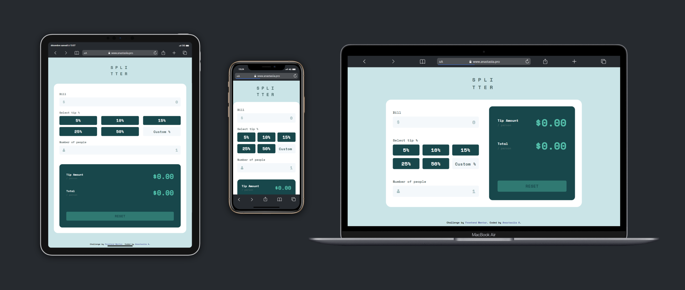

# Frontend Mentor - Tip calculator app solution 💰

This is my solution to the [Tip calculator app challenge on Frontend Mentor](https://www.frontendmentor.io/challenges/tip-calculator-app-ugJNGbJUX).

## Table of contents

- [Overview](#overview)
  - [The challenge](#the-challenge)
  - [Screenshot](#screenshot-of-my-result)
  - [Links](#links)
- [My process](#my-process)
  - [Built with](#built-with)
  - [What I learned](#what-i-learned)
- [Author](#author)

## Overview

### The challenge

Users should be able to:

- View the optimal layout for the app depending on their device's screen size
- See hover states for all interactive elements on the page
- Calculate the correct tip and total cost of the bill per person

### Screenshot of my result



<!-- Add a screenshot of your solution. The easiest way to do this is to use Firefox to view your project, right-click the page and select "Take a Screenshot". You can choose either a full-height screenshot or a cropped one based on how long the page is. If it's very long, it might be best to crop it.

Alternatively, you can use a tool like [FireShot](https://getfireshot.com/) to take the screenshot. FireShot has a free option, so you don't need to purchase it.  -->

### Links

- Live Site URL: [Feel free to play around or use](https://www.anastasiia.pro/projects/tip-calculator/) (any feedback would be highly appreciated!)
- My solution code: [The code you see right on this page](https://github.com/anastasiiaal/tip-calculator-app)
- Original challenge: [Frontend Mentor](https://www.frontendmentor.io/challenges/tip-calculator-app-ugJNGbJUX)

## My process

### Built with

- Semantic HTML5 markup
- CSS custom properties
- Tailwind CSS
- Flexbox
- CSS Grid
- JavaScript

### What I learned

This challenge helped me come back to and better memorize the Tailwind CSS classes, and doing some algo was a true pleasure!

Tailwind, you can be awesome sometimes:

```html
<div class="grid grid-cols-1 gap-6 md:grid-cols-2 md:gap-12 bg-white p-6 sm:p-8 rounded-3xl"></div>
```
```css
button.btn {
  @apply bg-primary text-dark uppercase py-3 text-xl mt-10 md:mt-32 opacity-40 cursor-not-allowed
}
```

Maths, I really did miss you:

```js
function countTotal (a,b,c) {
  if (a != "" && b != "" && c != "") {
    let resultTotal = ((a+(a*(b/100)))/c).toFixed(2);
    let resultTip = (resultTotal - (a/c)).toFixed(2);
    tipAmountPerPerson.innerHTML = resultTip;
    totalPerPerson.innerHTML = resultTotal;
    btnReset.classList.add('active');
  }
}
```

## Author

- Website - [My portfolio](https://www.anastasiia.pro/)
- Git Hub - [you are already here but ok](https://github.com/anastasiiaal)
